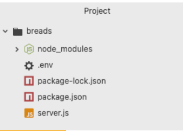

 # API-Project-Setup Instructions

## Setup Node/Express Project
* create a new project on Github/IDE
* in your terminal:
    * npm init -y
    * npm install express dotenv
* add the ".env" and "index.js" file into the project

<u><i><b>FINISHED SETUP EXAMPLE:</b></i></u>




## Setup Express Server
* in .env file:
    * PORT=port-number-of-your-choosing
* in index.js file:

```
// DEPENDENCIES/CONFIGURATION
require('dotenv').config()
const express = require('express')
const app = express()

app.use(express.json())

// ROUTES
app.get('/', (req, res) => {
  res.send('Welcome to a Sample API!')
})


// LISTEN
app.listen(process.env.PORT)
```
* in terminal:
    * type in "nodemon" to start the express server


## Mongoose Connection
* in terminal:
    * npm install mongoose
* in .env:
    * include the MONGO_URI
* In the 'models' folder, create an index.js folder that would help connect the MongoDB database to the API

```
const mongoose = require('mongoose')

mongoose.connect(process.env.MONGO_URI, {
    useNewUrlParser: true, 
    useUnifiedTopology: true
})
```